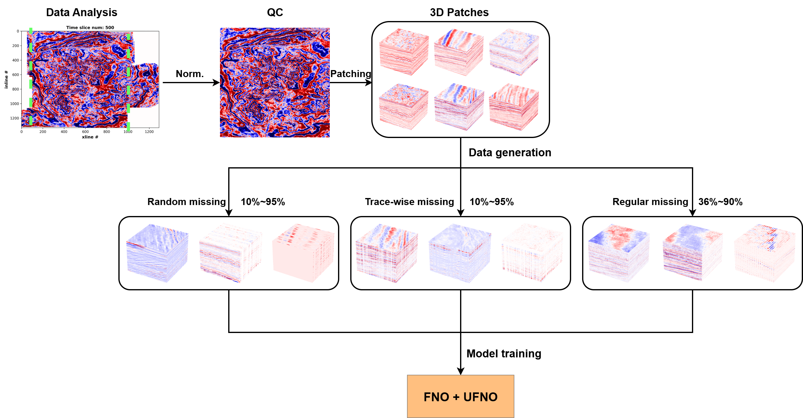

# [SeisReconNO: Leveraging a U-Net-Enhanced Fourier Neural Operator for 3D Seismic Reconstruction](https://doi.org/10.1016/j.aiig.2026.100212)

  <a href="https://github.com/traversa942" target="_blank">Alessandro Traversa1</a> &emsp;
  <a href="https://github.com/cuiyang512" target="_blank">Yang Cui1</a> &emsp;
  <a href="https://cpg.kfupm.edu.sa/bio/dr-umair-bin-waheed/" target="_blank">Umair bin Waheed1</a> &emsp;
  <a href="https://www.jsg.utexas.edu/researcher/yangkang_chen" target="_blank">Yangkang Chen2</a>

  1 College of Petroleum Engineering & Geosciences, King Fahd University of Petroleum & Minerals  
  2 Jackson School of Geosciences, University of Texas at Austin

  
  
  
  
  
  

## Abstract
Missing traces in 3D seismic data are a recurring challenge caused by receiver malfunctions, acquisition limitations, and geological or environmental constraints. These gaps hinder accurate interpretation and further processing. Although numerous model-driven approaches have been developed in recent decades, they often struggle with reconstructing the data with complex geological structures and high missing ratios. To address these limitations, we proposed a U-Net-enhanced Fourier Neural Operator (UFNO) 3D seismic reconstruction framework to achieve a mesh-invariant seismic reconstruction across different missing scenarios. The UFNO model leverages both spectral and spatial representations to learn a generalized reconstruction operator. We train the model on field 3D seismic cubes featuring three key missing-data patterns: random, trace-wise,  and regular. Experimental results demonstrate the superior reconstruction capability of UFNO across varying missing ratios. Moreover, the model exhibits strong generalization to unseen data with different resolutions, confirming its potential as a robust and adaptable tool for seismic data enhancement in real-world applications.

## Reference
    Traversa, Alessandro, Yang Cui, Umair Bin Waheed, and Yangkang Chen. "SeisReconNO: Leveraging a U–Net-Enhanced Fourier neural operator for 3D seismic reconstruction." Artificial Intelligence in Geosciences (2026): 100212.
BibTex

    @article{traversa2026seisreconno,
    title={SeisReconNO: Leveraging a U--Net-Enhanced Fourier neural operator for 3D seismic reconstruction},
    author={Traversa, Alessandro and Cui, Yang and Waheed, Umair Bin and Chen, Yangkang},
    journal={Artificial Intelligence in Geosciences},
    pages={100212},
    year={2026},
    publisher={Elsevier}}

## Install 
For set up the environment and install the dependency packages, please run the following script:
    
    conda create -n Seisrecon python=3.12
    conda activate Seisrecon
    conda install ipython notebook
    pip install torch==2.5.1, numpy==2.2.0, matplotlib==3.10.0, scikit-image==0.25.0, cigsegy==1.1.8, pylops==2.4.0

## Data preparation

The training data preparation workflow can be divided into five steps:
  1) **Downloading the 3D field seismic cubes from open-sources website (we used F3 data in Netherland and Moomba data in Australia for training):** After reading the seismic data using cigsegy, we muted those blank parts caused by the acquansition patches.
  2) **Quality control of seismic data:** We first normalized the 3D cubes. Then, we added the random noise generated by Gaussian function, to make this process reproducible, we utilized a specific random seed. We can achieve some denoising performance when dealing with raw data with random noise through adding some noise to the ground truth. Finally, we muted the seismic data with "blank" parts to obtain the label pataches without information loss. 
  3) **Patching the obtained 3D field cubes into small patches:** We introduced a 3D patching scheme with overlaps to augument the raw data. After the 3D patching stage, we obtained around 750 3D patches with the dimensions of $128 \times 128 \times 128$.
  4) **Create different types of training data:** For the random missing scenario, we prepare 250 training patches with trace missing ratios randomly varying from 10\% to 95\%. Similarly, we generate 250 training patches for the trace-wise missing with the same range of missing ratios as the random missing scenario. The regular missing pattern is defined using different stride choices to obtain 250 3D patches.
  5) **Combine missing data together:** After we obtained all types of missing data, we need to concatenate all the data together to get the training patches.

## Model and data

Regarding the training data, we used two open source post-stack 3D seismic data:

  1) **F3 data from Netherland:** [F3 open-source data](https://wiki.seg.org/wiki/F3_Netherlands)
  2) **Moomba lake data from Austrilia:** [Moomba open-source data](https://catalog.sarig.sa.gov.au/document/mesac35250)
  3) **Kerry data from New Zealand:** [Kerry open-source data](https://wiki.seg.org/wiki/Kerry-3D)
  4) **Mobil Avo Viking Graben Line 12, prestack:**[Prestack open-source data](https://github.com/douyimin/MDA_GAN)
  5) **Due to the limitation of Github, we uploaded all the saved training model to a Google Drive folder. Please download them from the attached link:** [save wieght matrix Goole Drive](https://drive.google.com/drive/folders/1CjeKiHW0GV_PfeqWZDzzwb2J0Zm6tEA1?usp=sharing)

After downloading the given pre-trained models, please put the trained model into the "model" folder.

The model of Wen et al. 2022 was modified for seismic reconstruction purposes. The first layer, through which the data pass, is the padding layer, which consists of adding additional values (zeros, constants or other specified values) around the edges of the tensor to preserve edge information in the convolutional layers. After that, two Fourier neural operator (FNO) layers are applied. These FNO layers use the Fourier transform to obtain features from the frequency domain, but it also incorporates operations in the spatial domain to complement this and refine the extracted them. The workflow is as follows:
     
   - **Fourier Transform:** The input tensor is converted from the spatial domain to the frequency domain using the fast Fourier transform (FFT). Since we are working with three dimensions in the neural network (timeslice, inline and xline).
   -  **Learnable Weight Multiplication:** The Fourier coefficients are modified by multiplying them by learnable weights.
   -  **Truncation of Frequency Modes:** To avoid over-fitting, only a fixed number of low-frequency modes are retained and this hyper is called modes, that for this model is 10.
   -  **Inverse Fourier Transform:** The modified Fourier coefficients are transformed back to the spatial domain using the Inverse FFT.
   -  **Spatial Operations in FNO:** The FNO layer uses additional linear transformations directly in the spatial domain to complement the global features extracted in the Fourier domain by adding them, the widht of this linear transformatons are 16.

After the FNO layer, two more U-FNO layers are added. They are similar to the FNO, but a U-net is added to the model in the spatial domian representation. In general, the functionality of the U-net is downsampling the data by passing through successive convolutional layers and pooling or strided convolutions to reduce spatial dimensions, extract representation in a latent space and after upsampling the data. This addition of U-Net-like convolutional layers increases the extraction features. Among the hyperparameters that we used are a dropuout system, a kernel size of 3, Leaky ReLU was used as activation function. The  architecture used was thre downsampling convolutional layers and upsampling convolutional layers.

Then a Dense connection layer is applied and at the end of the model, the original dimensions are restored by removing the extra padding using slicing.

## Training process

The training process workflow can be divided into 4 steps:
  1) **Training data:** 750 patches were used (from F3 and moomba 3D cube) and combine them together as input. In the same path, the label were created by combining both F3 and Moomba 3D clear cube (without any missing traces and noisy).
  
  2) **Reshaping the data:** The training data was reshape into [batchsize, time slice, inline, xline].
  
  4) **Stablish the Hyperparameters:**

      - **Number of Epochs**: 200
      - **Learning Rate**: 1e-3
      - **Step Size**: 2
      - **Gamma**: 0.9
      - **Batch Size**: 1 (due to memory constraints)
      - **Data Split**:
        - **Training**: 90% 
        - **Validation**: 10% 
      - **Optimizer**: ADAM
      - **Loss Function**: Mean Square Error (MSE)

5) **train the model with the input** 
      
## How to run the training code?

  1) **Step 1: Download seismic cubes**: [F3](https://wiki.seg.org/wiki/F3_Netherlands), [Moomba]([https://sarigbasis.pir.sa.gov.au/WebtopEw/ws/samref/sarig1/wci/ResultSet?w=NATIVE(%27REFERENCE+ph+is+%22Env%2009124%22%27);order=TITLE;r=1;m=1;rpp=25](https://catalog.sarig.sa.gov.au/document/mesac35250)), and [Kerry](https://wiki.seg.org/wiki/Kerry-3D).
  2) **Step 2: QC and patches generation**: You can simply run [patch_generation_field_cubes.ipynb](https://github.com/cuiyang512/SeisReconNO/blob/main/Data_processing/patch_generation_field_cubes.ipynb) for each cube and save the .npy files of the field cubes.
  3) **Step 3: run the train code**: Note that we provide two versions of the network training code. The python script makes the training process soomthly [train.py](https://github.com/cuiyang512/ML-UFNO-3D-Seis-Recon/blob/main/train.py). While the jupyter notebook script provide some visualization steps to make sure the training process goes correctly 
[UFNO_3D_recon_train.ipynb](https://github.com/cuiyang512/ML-UFNO-3D-Seis-Recon/blob/main/notebook/UFNO_3D_recon_train.ipynb).

## Development

    The development team welcomes voluntary contributions from any open-source enthusiast. 
    If you want to make contribution to this project, feel free to contact the development team. 
    
## Contact

    Regarding any questions, bugs, developments, collaborations, please contact  
    Yang Cui & Alessandro Traversa
    yang.cui512@gmail.com
    traversa942@gmail.com
differential equations. arXiv preprint arXiv:2010.08895.
